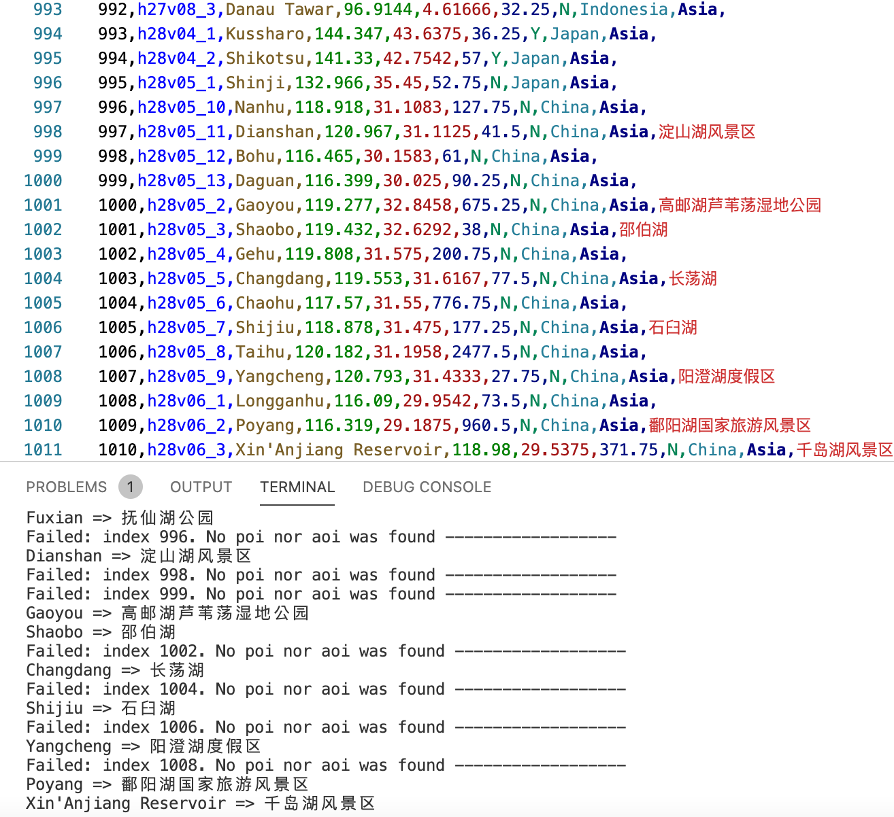

# Batch Translation for Lakeinfo Table
Fetch and add Chinese translation of lake names for the LakeInfo table of the remote-sensed FUI dataset using Amap API

## Usage

1. Put `lake_info.csv` & `lake_chnName.py` in the same folder.
2. *(Optional)* Adjust variables in the script (e.g. `poiname_field_name`, `country_field_name`, `Country/Region`, `longitude_field_name`, `latitude_field_name`).
3. Run `lake_chnName.py`.
4. Paste your Amap <u>**WebService**</u> API key.

Since not all lakes listed in the csv table can be matched a Chinese name by requesting AmapAPI, you have to manually fix missing names and naming errors.

## Screenshot

